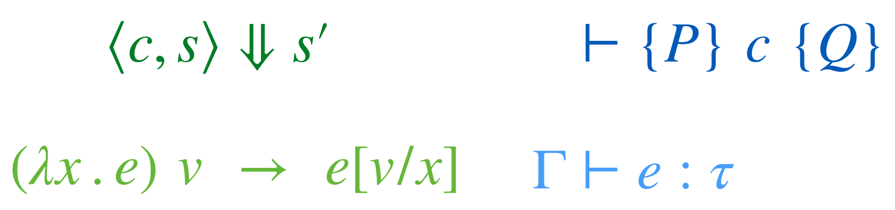

# CSE 230: Principles of Programming Languages CSE 230

[Resources](#resources) - [Schedule](#schedule) - [Grading](#grading) - [Policies](#policies)

## Summary

CSE 230 is an introduction to the Semantics of Programming Languages.
Unlike most engineering artifacts, programming languages and hence,
programs are _mathematical objects_ whose properties can be formalized.
The goal of CSE 230 is to to introduce you to the fundamental _mental_
and _mechanical_ tools required to rigorously analyze languages and programs and
to expose you to recent developments in and applications of these techniques/

We shall study _operational_ and _axiomatic_ semantics,
two different ways of precisely capturing the meaning
of programs by characterizing their executions.

We will see how the _lambda calculus_ can be used to
distill essence of computation into a few powerful constructs.

We use that as a launching pad to study expressive _type systems_
useful for for analyzing the behavior of programs at compile-time.

We will study all of the above in the context of [lean](https://lean-lang.org/),
an interactive proof assistant that will help us precisely formalize and verify
our intuitions about languages and their semantics.

Students will be evaluated on the basis of 4-6 programming (proving!) assignments, and a final exam.

## Prerequisites

Basic functional programming e.g. as taught in
[UCSD CSE 130](https://ucsd-cse130.github.io/wi24) using
languages like Haskell, OCaml, Scala, Rust, and undergraduate level
discrete mathematics, i.e. logic, sets, relations.

## Basics

- **Lecture:** _PRICE Center Theatre_ TuTh 12:30p-1:50p
- **Discussion:** _CENTER 212_ Fr 2:00-2:50pm
- **Final Exam:** 03/18/2025 Tu 11:30a-2:29p
- **Podcasts:** [podcast.ucsd.edu](https://podcast.ucsd.edu/watch/wi25/cse230_a00)
- **Piazza:** [Piazza](https://piazza.com/ucsd/winter2025/cse230)

## Staff

|      |                                               | Office Hours |
| :--- | :-------------------------------------------- | :----------- |
| Prof | [Ranjit Jhala](https://ranjitjhala.github.io) |              |
| TA   | Matthew Kolosick                              |              |
| TA   | Nico Lehmann                                  |              |
| TA   | Naomi Smith                                   |              |
| TA   | Kyle Thompson                                 |              |

Office hours are concentrated on Wed, Thu, Fri, since most
assignments are due Friday evening. Please check the calendar
before you come in case there have been any changes. When you
come to the office hour, we may ask you to put your name in
the queue using the whiteboard. Read the description about
[collaboration below](#policies) for some context about
office hours.

## Resources

The course is loosely based on [Concrete Semantics](http://www.concrete-semantics.org/)
but there is no official textbook; we will link to any relevant resources that may be
needed to supplement the lecture material. Some useful links are:

- [Lean](https://lean-lang.org/)
- [Theorem Proving in Lean4](https://lean-lang.org/theorem_proving_in_lean4/)
- [Concrete Semantics](http://www.concrete-semantics.org/)
- [Software Foundations](https://softwarefoundations.cis.upenn.edu/)
- [Hitchhikers Guide to Logical Verification](https://lean-forward.github.io/hitchhikers-guide/2023/)
- [PL Foundations in Agda](https://plfa.github.io/)

## Schedule

The schedule below outlines topics, due dates, and links to assignments. The
schedule of lecture topics might change slightly, but I post a general plan so
you can know roughly where we are headed.

The typical due dates are that **assignments** and **quizzes** are due Friday evenings.

[Code](https://github.com/ucsd-cse230/wi25-code)

### Week 1 - Basics and Induction

- Expressions and Types
- Datatypes and Polymorphism 
- Recursion and Induction (Ch02)

### Week 2 - Expressions and Evidence

- Compiling Expressions to Stack Machines (Ch03)
- Induction on Evidence (Ch04)

### Week 3 - Big Step Semantics

- Imperative Programs: States, Commands, Transitions
- Program Equivalence (Ch07)

### Week 4 - Small Step Semantics

- Preservation and Progress (Ch09)

### Week 5, 6 - Axiomatic Semantics

- Assertions, Floyd-Hoare Logic, Soundness (Ch12)
- Verification Conditions and Automatic Verification

### Week 7, 8 - Simply Typed Lambda Calculus

- Terms, Types, and Typing Rules
- Denotational Semantics and Type Soundness

### Week 9, 10 - Automated Verification

- Satisfiability Modulo Theories
- Flux: Refinement Type based verification for Rust

## Grading

Your grade will be calculated from **assignments**, **exam**, and **participation**

- **Participation Quizzes (15%)**
  Most lectures will come with a 1-2 page handout, and you can submit
  the handout any time up until the start of the next lecture.
  Credit is given for reasonable effort in engaging with the material
  from the day on the handout.

- **Programming Assignments (50%)**
  There will be a total of 5-6 programming assigments, to be _done_
  in pairs but _submitted_ individually.

- **Final Exam (35%)**
  During finals week, details TBD.

**Comprehensive Exam**: For graduate students using this course for a
comprehensive exam requirement, you must get "A" achievement on the
final exams.

## Policies

All assignments are **Closed collaboration** assignments,
where you cannot collaborate with others (except your partner).
Of course you can ask questions on Piazza, and come to office hours etc.
In particular,

- You cannot look at or use anyone else's code for the assignment
- You cannot discuss the assignment with other students
- You cannot post publicly about the assignment on the course message
  board (or on social media or other forums). Of course, you can still
  post questions about material from lecture or past assignments!

You should be familiar with [the UCSD guidelines](http://senate.ucsd.edu/Operating-Procedures/Senate-Manual/Appendices/2)
on academic integrity as well.

### Late Work

You have a total of _six late days_ that you can use throughout the quarter,
but no more than _four late days_ per assignment.

- A late day means anything between 1 second and 23
  hours 59 minutes and 59 seconds past a deadline
- If you submit past the late day limit, you get 0 points for that assignment
- There is no penalty for submitting late but within the limit

### Regrades

Mistakes occur in grading. Once grades are posted for an assignment, we will
allow a short period for you to request a fix (announced along with grade
release). If you don't make a request in the given period, the grade you were
initially given is final.

### Laptop/Device Policy in Lecture

There are lots of great reasons to have a laptop, tablet, or phone open
during class. You might be taking notes, getting a photo of an important
moment on the board, trying out a program that we're developing together, and
so on. The main issue with screens and technology in the classroom isn't your
own distraction (which is your responsibility to manage), it's the
distraction of **other students**. Anyone sitting behind you cannot help but
have your screen in their field of view. Having distracting content on your
screen can really harm their learning experience.

With this in mind, the device policy for the course is that if you have a
screen open, you either:

- Have only content onscreen that's directly related to the current lecture.
- Have unrelated content open and **sit in one of the back two rows of the
  room** to mitigate the effects on other students. I may remind you of this
  policy if I notice you not following it in class. Note that I really don't
  mind if you want to sit in the back and try to multi-task in various ways
  while participating in lecture (I may not recommend it, but it's your time!)

### Diversity and Inclusion

We are committed to fostering a learning environment for this course that
supports a diversity of thoughts, perspectives and experiences, and respects
your identities (including race, ethnicity, heritage, gender, sex, class,
sexuality, religion, ability, age, educational background, etc.). Our goal is
to create a diverse and inclusive learning environment where all students feel
comfortable and can thrive.

Our instructional staff will make a concerted effort to be welcoming and
inclusive to the wide diversity of students in this course. If there is a way
we can make you feel more included please let one of the course staff know,
either in person, via email/discussion board, or even in a note under the door.
Our learning about diverse perspectives and identities is an ongoing process,
and we welcome your perspectives and input.

We also expect that you, as a student in this course, will honor and respect
your classmates, abiding by the UCSD Principles of Community
(<https://ucsd.edu/about/principles.html>). Please understand that others’
backgrounds, perspectives and experiences may be different than your own, and
help us to build an environment where everyone is respected and feels
comfortable.

If you experience any sort of harassment or discrimination, please contact the
instructor as soon as possible. If you prefer to speak with someone outside
of the course, please contact the Office of Prevention of Harassment and
Discrimination: <https://ophd.ucsd.edu/>.
