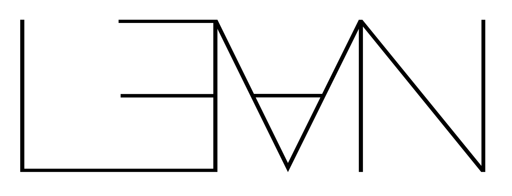

# Hello, World!

Welcome to CSE 230!


**Principles of Programming Languages**

i.e.

**Formal Semantics**

i.e.

**Programs as Mathematical Objects**

<br>
<br>
<br>
<br>
<br>
<br>
<br>
<br>

## Computation is **Specified** by Programming Languages

Increased dependence **implies** increased need for analysis

- **Safety** Will this code _crash_?
- **Security** Will this code broadcast my _social security number_?
- **Performance** Will this code run in the appropriate time/space constraints?

<br>
<br>
<br>
<br>
<br>
<br>
<br>
<br>

## Computation is **Specified** by Programming Languages

Increased dependence **implies** increased need for analysis

- **Safety** Will this code _crash_?
- **Security** Will this code broadcast my _social security number_?
- **Performance** Will this code run in the appropriate time/space constraints?

<br>
<br>
<br>
<br>
<br>
<br>
<br>
<br>


## CSE 230: PL/Programs are mathematical objects

**Mental** and **Mechanical** tools to reason about programs

Rigorous specification, analysis of PL/Programs...

... and thus, computation

<br>
<br>
<br>
<br>
<br>
<br>
<br>
<br>

## CSE 230: Learning Outcomes

**Goal: Mechanized Formal Semantics**

– Intellectual and Algorithmic tools for reasoning about program behavior

<br>
<br>
<br>

### Semantics

- What does a program **mean**?
- What does a program **do**?

<br>
<br>
<br>

### Formal

- We will **define** these objects mathematically
- We will learn how to **prove** things about these objects

<br>
<br>
<br>

### Mechanized

- We will learn to use a *precise* language and *tools* to write these proofs

<br>
<br>
<br>

## Why bother with Formal Semantics?


... Won't LLMs like `ChatGPT`, `Claude`, `Grok`, ... write all the programs?

<br>
<br>
<br>
<br>
<br>
<br>
<br>
<br>
<br>


<br>
<br>
<br>
<br>
<br>
<br>
<br>
<br>
<br>

## Why bother with Formal Semantics?


<br>
<br>
<br>
<br>

> Ranjit: What is the central thesis of "thinking fast and slow"?

Via [`claude`](https://claude.ai/) -- emphasis mine.

The central thesis of "Thinking, Fast and Slow" by **Daniel Kahneman**
is that human thinking operates in two distinct systems

- **System 1 is fast, intuitive, and emotional.**
  It operates automatically with little or no effort
  and no sense of voluntary control. It makes quick
  judgments *based on familiar patterns*, but is
  *prone to systematic errors and cognitive biases*.

- **System 2 is slower, more deliberative, and more logical.**
  It allocates attention to effortful mental activities
  that demand it, including *complex calculations and careful reasoning*.
  While more reliable than System 1, it is *lazy* and often
  defers to System 1 unless specifically engaged.

Kahneman argues that while System 1 is remarkably capable,
its biases and shortcuts (heuristics) can lead to predictable
errors in judgment. Many of our decision-making problems stem
from System 1 making quick judgments when slower, more analytical
System 2 thinking would be more appropriate. Yet we can't simply
turn off System 1 - both systems serve important functions and
work together to shape our thoughts and decisions.

**System 1 == LLMs**  vs **System 2 == Formal Semantics**

( H/T to [Adithya Murali](https://muraliadithya.github.io/) for the analogy... )


<br>
<br>
<br>
<br>
<br>
<br>
<br>
<br>
<br>


## Why Formal Semantics in the age of LLMs?

LLMs ==> more *code* ==> more *bugs*

1. More **need** to really understand code!

2. More **tools** to help understand code!

(i.e. The more you rely on "system 1", the more you need "system 2"!)

<br>
<br>
<br>
<br>
<br>
<br>
<br>
<br>
<br>

## Lean



**Lean** is a programming language and theorem prover

- Used to write mathematical proofs that are automatically verified by the computer

- Similar to many other theorem provers like Rocq (Coq), Agda, Isabelle, etc.

- Used in academia and industry for formal verification

**Two main features for CSE 230**

- Helps *define* and *prove* things about languages and programs

- Example of *state-of-the-art* programming language

<br>
<br>
<br>
<br>
<br>
<br>
<br>
<br>
<br>
<br>

## A quick taste of lean...

You can **define** functions...

```lean
def sum (n: Nat) : Nat :=
  match n with
  | 0 => 0
  | m + 1 => m + 1 + sum m
```

You can **evaluate** i.e. "run" them ...

```lean
#eval sum 10
```

You can **automatically check** simple facts about them...

```lean
theorem sum_10_eq_55 : sum 10 = 55 :=
  rfl
```

And finally, you can **write proofs** for more complicated facts ...

```lean
theorem sum_eq : ∀ (n: Nat),  2 * sum n = n * (n + 1) := by
  intros n
  induction n
  . case zero =>
    rfl
  . case succ =>
    rename_i m ih
    simp_arith [sum, Nat.mul_add, ih, Nat.mul_comm]
```


<br>
<br>
<br>
<br>
<br>
<br>
<br>
<br>

## Logistics

Lets talk about the course logistics...

<br>
<br>
<br>
<br>
<br>
<br>
<br>
<br>

## Course Outline

About 2-ish weeks per topic, roughly following [Concrete Semantics](https://concrete-semantics.org/) by Tobias Nipkow and Gerwin Klein

**Part I: Basics of Lean and Proofs**
- Expressions & Types
- Datatypes & Proofs
- Recursion & Induction & Evidence

**Part II: Operational Semantics**
- Big Step Semantics
- Small Step Semantics

**Part III: Axiomatic Semantics**
- Floyd-Hoare Logic
- VC Generation and Automated Verification

**Part IV: Types**
- Simply Typed Lambda Calculus
- Denotational Type Soundness

<br>
<br>
<br>
<br>
<br>
<br>
<br>
<br>
<br>


## Prerequisites

Basic **functional programming**
- e.g. as taught in [UCSD CSE 130](https://ucsd-cse130.github.io/wi24)
- using languages like Scheme, Haskell, Ocaml, Scala, Rust, ...

Undergraduate level **discrete mathematics**,
- e.g. as taught in [UCSD CSE 20](https://cseweb.ucsd.edu/classes/sp18/cse20-a/)
- boolean logic, quantifiers, sets, relations, ...

You _may_ be able to take 130 if you're unfamiliar with the above but ...

<br>
<br>
<br>
<br>
<br>
<br>
<br>

## Grading

Your grade will be calculated from **assignments**, **exam**, and **participation**

- **Handouts (15%)**
  Most lectures will come with a 1-2 page handout, and you can submit
  the handout any time up until the start of the next lecture.
  Credit is given for reasonable effort in engaging with the material
  from the day on the handout.

- **Programming Assignments (40%)**
  There will be a total of 5-6 programming assigments, to be _done_
  in pairs but _submitted_ individually.

- **In Class Exams (45%)**
  We will have three "in-class exams" **Th 1/30** and **Tu 2/25** and **Th 3/13**
  each worth 15% of the grade.

**Comprehensive Exam**: For graduate students using this course for a
comprehensive exam requirement, you must get "A" achievement on the exams.

<br>
<br>
<br>
<br>
<br>
<br>
<br>
<br>
<br>
<br>

## Assignments (5-6)

- You can work with a partner, but **submit individually**
- Github Classroom + Codespaces

**Assignment 0**
Fill out [this form to link UCSD ID and Github](https://forms.gle/RaMSzzKCkgDYfKQYA)

<br>
<br>
<br>
<br>
<br>
<br>

And now, let the games begin...!


