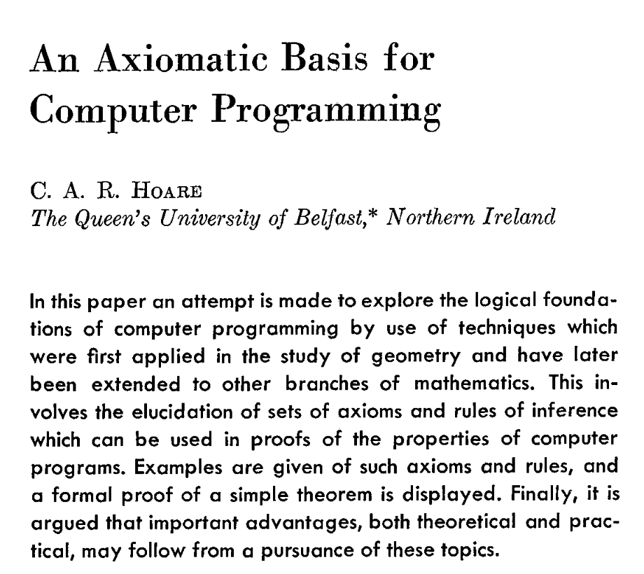
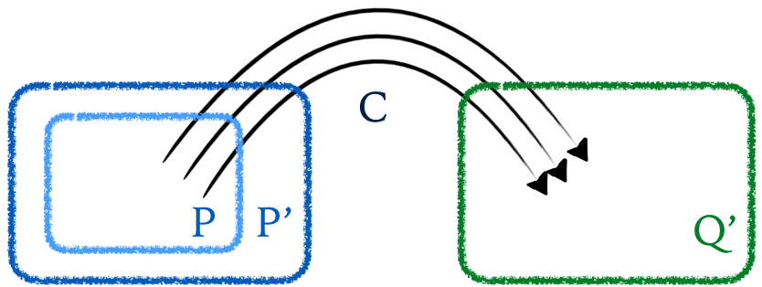

```lean
import Cse230wi25.BigStep

set_option pp.fieldNotation false
set_option pp.proofs true
```


# Axiomatic Semantics

The `BigStep` semantics that was saw previously was helpful in proving properties
about **groups** of programs, for example, that

1. that *every* command `c` was **deterministic** or
2. that *every* command `c` was **equivalent to** `SKIP ;; c` or `IF cond THEN c ELSE c` or
3. that *every* command `x <~ a;; y <~ a` was equivalent to `x <~ a;; y <~ x` (if `x` was not read in `a`).

Next, lets try to use the `BigStep` semantics to check properties of **individual** programs.


## Example: Swapping two Variables

Consider the following `Com` program that *swaps*
the values of `x` and `y` using `z` as a temporary
storage.


```lean
open Aexp

def swap :=

-- {{ y = b /\ x = a }}

  z <~ var x ;;

-- {{ y = b /\ z = a }}

  x <~ var y ;;

-- {{ x = b /\ z = a }}

  y <~ var z

-- {{ x = b /\ y = a }}


theorem swap_ok : ∀ {s t a b},
  (⟨ swap , s ⟩ ==> t) ->
  (s x = a /\ s y = b) ->
  (t x = b /\ t y = a) := by
  intros s t a b swap_s_t xa_yb
  simp_all [swap]
  cases xa_yb; rename_i xa yb
  cases swap_s_t
  rename_i swap_1 swap_23
  cases swap_23
  rename_i swap_2 swap_3
  cases swap_1
  cases swap_2
  cases swap_3
  simp [aval, upd, *]
```


Lets try to prove that `swap` indeed correctly swaps the values of `x` and `y`.

How can we *specify* this correctness property as a theorem?

How can we *prove* that theorem?

<br>
<br>
<br>
<br>
<br>


```lean
theorem swap_swaps : ∀ {s t : State} {n m : Val},
  s x = n -> s y = m -> (⟨ swap, s ⟩ ==> t) -> (t x = m) /\ (t y = n) := by
```
  intros s t n m sxn sym swap_123
  simp_all [swap]
  cases swap_123; rename_i s1 swap_1 swap_23
  cases swap_23; rename_i s2 swap_2 swap_3
  cases swap_1; cases swap_2; cases swap_3
  simp_all [aval, upd]


Instead of the `cases` we can prove a theorem that precisely characterizes what the "shape"
of output state of an assignment is:


```lean
-- @[simp]
theorem assign_step : ∀ {x a s t}, (⟨ x <~ a, s ⟩ ==> t) <-> (t = (s [x := aval a s])) := by
  intros x a s t
  apply Iff.intro
  . case mp => intros xs; cases xs ; trivial
  . case mpr => intros; simp_all [] ; apply BigStep.Assign
```


And now, we can tell `lean` to use that `assign_step` to "fill in" the intermediate
`s1`, `s2` and `s3` to complete the proof.

```lean
theorem swap_swaps' : ∀ {s t : State} {n m : Val},
  s x = n -> s y = m -> (⟨ swap, s ⟩ ==> t) -> (t x = m) /\ (t y = n) := by
  intros s t n m sxn sym swap_123
  simp_all [swap]
  cases swap_123; rename_i s1 swap_1 swap_23
  cases swap_23; rename_i s2 swap_2 swap_3
  simp_all [assign_step, aval, upd]
```


Well, that wasn't _too_ bad. But lets try a more interesting example:.

## Example: Summing the numbers from 0..n

Consider the following *loop* which sums up the values of the numbers from `0` to `x`


∀ {start finish a},
⟨ sum_com, start ⟩ ==> finish
->
start x = a
->
finish y = sumTo a

start
  x = a
finish
  y = sumTo a


```lean
def sumTo (n: Nat) : Nat :=
  match n with
  | 0 => 0
  | n' + 1 => n' + sumTo n'


def sum_com : Com :=
-- {{ x = a }}
  y <~ 0 ;;
-- {{ x = a /\ y = 0 }}
   WHILE
--   {{ x <= a }}
     0 << x
   DO
--   {{ x <= a /\ 0 < x }}
    y <~ y + x ;;
    x <~ x - 1
  END

-- {{ y = sum a }}

-- x = a, y = 0
-- x = a-1, y=a
-- x = a-2, y=a + a -1
-- x = a-3, y=a + a - 1 + a - 2
-- x = 0  , y= a + a-1 + a-2 + ... + 1
-- y = 1 + 2 + 3 + ... + a
```

How can we **specify** that this correctly sums up the numbers `0 + ... + n` ?

<br>
<br>
<br>
<br>
<br>


```lean
def sum (n:Nat) : Nat :=
  match n with
    | 0      => 0
    | n' + 1 => n + sum n'

-- A program! ------------------------------------------------------------

abbrev csum := y <~ y + x ;; x <~ x - 1
abbrev wsum := WHILE 0 << x DO csum END
abbrev imp_sum := "y" <~ 0 ;; wsum

theorem wsum_sum' : (⟨ wsum, s ⟩ ==> t) -> ((t "y") = s "y" + sum (s "x")) := by
  sorry
  -- intro wsum_s_t
  -- generalize h : wsum = ws at wsum_s_t -- LEAN:ANF BUG
  -- induction wsum_s_t <;> simp_all [wsum]
  -- . case WhileFalse =>
  --   cases h
  --   rename_i c _ s bfalse left _
  --   simp [<-left] at bfalse
  --   simp_all [bval, aval, sum]
  -- . case WhileTrue =>
  --   cases h
  --   rename_i b c s s1 t btrue c_s_s1 w_s1_t left right
  --   simp [<-left] at btrue
  --   sorry


theorem csum_sum : (⟨ csum, s ⟩ ==> t) -> ( (t "x" = s "x" - 1) /\ (t "y") = s "y" + s "x")
  := by
  intros cs; cases cs; rename_i s1 st1 st2; simp_all [assign_step]
  by_cases (x=y) <;> (simp_all [upd, aval]; try intros; contradiction)

theorem wsum_sum : (⟨ wsum, s ⟩ ==> t) -> ((t "y") = s "y" + sum (s "x")) := by
  intros wsums
  generalize h : wsum = ws at wsums -- LEAN:ANF BUG
  induction wsums <;> try simp_all []
  .case WhileFalse =>
   cases h
   rename_i b c s bfalse cond _
   have x_eq_0 : s "x" = 0 := by
     simp [<-cond, bval, aval] at bfalse
     assumption
   simp_all [sum]
  .case WhileTrue =>
    rename_i b csum s s1 s2 btrue c_step _ _ _
    cases h
    rename_i cond hr
    have s1xy : s1 "x" = s "x" - 1 /\ s1 "y" = s "y" + s "x" := by
      apply csum_sum; simp_all []
    cases s1xy
    have sum_x : sum (s "x") = s "x" + sum (s "x" - 1) := by
      simp [<-cond, bval, aval] at btrue
      generalize hx : s "x" = sx
      cases sx <;> simp_all [sum]
    simp_all [Nat.add_assoc]

theorem while_sum : (⟨ imp_sum, s ⟩ ==> t) -> t "y" = sum (s "x") := by
  intros ws
  cases ws
  rename_i y0_step ws_step
  cases y0_step
  generalize h : upd s y (aval 0 s) = s0 at ws_step
  have hyp  : ((t "y") = s0 "y" + sum (s0 "x")) := by apply wsum_sum; simp_all [<-h]
  have h0   : s0 "y" = 0 := by simp_all [<-h, upd, aval]
  have s0_x : s0 "x" = s "x" := by simp_all [<-h, upd]
  simp_all []
```


Yikes, that was like pulling teeth. Lets look at a better way, introduced by
Robert Floyd, back in 1967 (using the same example!)


Floyd's paper formulated everything for **flow-charts**

In 1969 Tony Hoare reformulated those ideas as



which is what we today call **axiomatic semantics** or **Floyd-Hoare (FH) Logic**.

## Assertions

The *central* idea in FH logic is the notion of an **assertion** which is simply property of a `State`,
that is some **fact** that is true (or not) about a particular program `State`.


```lean
abbrev Assertion := State -> Prop
```

For example, the state `s` defined as `s0 [x := 10] [ y := 20]` satisfies the following assertions

- `λ s -> s x < s y`
- `λ s -> s x + s y = 30`

but *does not* satisfy the assertions

- `λ s -> s x = 0`
- `λ s -> s x > s y`

## Floyd-Hoare Triples

A Floyd-Hoare **triple** is a `{{ p }} c {{ q }}` where

- `p` is a **pre-condition** assertion,
- `c` is a **command**, and
- `q` is a **post-condition**.

Intuitively, the triple `{{ p }} c {{ q }}` says that

**If**
- the command `c` is executed from a state where the _precondition_ `p` holds and
- the execution of `c` _terminates_,

**Then**
- upon termination, the _postcondition_ `q` will hold.

We can state the above precisely by defining when a triple is *valid*


```lean
@[simp]
def Valid (p: Assertion) (c: Com) (q: Assertion) :=
  ∀ s t, p s -> (⟨ c, s ⟩ ==> t) -> q t

notation:10 "⊧" " {{" p "}} " c " {{" q "}}" => Valid p c q
```

## Example: Correctness of `imp_sum`

We can restate the correctness of `imp_sum` as a FH triple as


    { p } SKIP    { p }


    { q [[ x := a ]] } x <~ a  { q }


    { a > 15  } x <~ a  { x > 15 }


```lean
example : ∀ {n},
  ⊧ {{ fun s => s "x" = n }} imp_sum {{ fun t => t "y" = sum n }}
  := by
  simp_all []
  intros n s t xn imp_step
  simp_all [<-xn]
  apply while_sum
  trivial
```


## Floyd-Hoare Logic

The notion of a *valid triple* is useful in defining a *specification* of correctness,
but we still have to go through the painful and quite tedious proof of `while_sum` to
actually *verify* the triple.

### Proof Rules

The really clever contribution of Floyd and Hoare was to come up with a **recipe**
comprising a system of **proof rules** that can be **automatically** applied to do
the verification, without *ever* directly using the big-step semantics!

These rules are **compositional** meaning that we derive the triple `{P} c {Q}`
by using sub-derivations on the sub-commands of `c`.


### Rule: Skip

For example, we have a rule for the `Skip` command that says

```
---------------- [skip]
⊢ {P} SKIP {P}
```

That is, for *any* assertion `p` we can derive that if `p` holds _before_ the `SKIP`
then it must hold _after_ as well.

### Rule: Sequence

The rule for sequencing two commands `c1; c2` says that

```
⊢ {p} c1 {q}      ⊢ {q} c2 {r}
--------------------------------[seq]
⊢ {p} c1; c2 {r}
```

That is, `⊢ {p} c1; c2 {r}` holds if

1. there is some *intermediate assertion* `q`
2. that holds after executing `c1` from a `{p}` state, and
3. `c2` then takes all `q` states to `r` states.

### Rule: Assignment

The rule for assignment is quite tricky.

When *can* we be sure that some assertion `q` holds *after* executing `x <~ a` ?

Lets look at some examples to build up some intuition.

What assertion can you write for `???` in each of the below?

- `{???} x <~ 10  { x > 0 }`

- `{???} x <~ y   { x > 0 }`

- `{???} x <~ a+b { x + a > 0 }`

Can you spot some sort of a **pattern**?

Indeed, if we want `q` to be true *after* the assignment `x <~ a` then

1. The _only_ change made by the assignment is to `x`

2. So it must be that `q` is true _before_ the assignment

3. Except with all occurences of `x` (in `q`) replaced with `a` !

### Example: `Swap`

Lets see how the rules for assignment and sequence work for our `swap` example from above.

```
{{ s y = b /\ s x = a }}

  z <~ var x ;;

{{ s y = b /\ s z = a }}

  x <~ var y ;;

{{ s x = b /\ s z = a }}

  y <~ var z

{{ s x = b /\ s y = a }}
```

### Rule: If-Then-Else

Lets try to work out the rule for establishing
a triple `⊢ {p} IF cond THEN c1 ELSE c2 {q}`.

Lets think about this triple:

```
{ ??? }

  IF 0 < x

    THEN y <~ x

    ELSE y <~ 0 - x

{ 0 <= y }
```

What must be true _before_ the IF-THEN-ELSE
so that we can be sure that `0 <= y` _after_?

How can we know that the above triple holds?

Can you think of the appropriate triples that
must hold for `c1` and `c2` ? How about the rule

```
⊢ {P} c1 {Q}    ⊢ {P} c2 {Q}
-------------------------------- [If]
⊢ {P} IF b THEN c1 ELSE c2 {Q}
```

Is it "sound" (does it **prove invalid triples** ?)

Is it "complete" (does it **prevent proving valid triples?**)

How can we fix the rule?

```
⊢ {???} c1 {Q}    ⊢ { ??? } c2 {Q}
------------------------------------ [If]
⊢ {P} IF b THEN c1 ELSE c2 {Q}
```

Lets go back to the example


```
⊢ {true /\ 0 < x} y <~ x { 0 <= y }   ⊢ {true /\ ¬ 0 < x} y <~ 0 - x { 0 <= y }
-------------------------------------------------------------------------------- [If]
⊢ { true } IF (0 < x) THEN y <~ x ELSE y <~ 0 - x) { 0 <= y }
```


### FH rules are too "tight"


Consider this triple: _surely_ it should be valid but we
cannot *prove* it with our rules :-(

```
{x = 10} SKIP { x > 0}          (ex1)
```

The skip rule will let us prove that

```
⊢ {x=10} SKIP {x=10}
```

and that

```
⊢ {x > 0} SKIP {x > 0}
```

but surely we should _also_ be able to prove `{x=10} SKIP {x>0}`?

Here's another example.

```
{x = 0} x <~ x + 1 {x = 1}      (ex2)
```

The `Assign` rule will let us prove that `{x+1 = 1} x <~ x + 1 {x = 1}` but
not directly that `{x=0} x <~ x + 1 {x=1}` ... which seems silly!

Can you think about *why* the above triples `ex1` and `ex2`  hold?

### Bonus Rule: Consequence

How can we encode the above intuition as a *rule*?

<br>
<br>
<br>
<br>
<br>
<br>
<br>
<br>
<br>
<br>

We can *relax* the FH rules with the **rule of consequence** shown below.

```
∀ s. P(s) => P'(s)    ⊢ {P'} c {Q'}     ∀ s. Q'(s) => Q(s)
----------------------------------------------------------- [Consequence]
⊢ {P} c {Q}
```

This rule says that

- if you can establish the triple `⊢ {P'} c {Q'}` then


- you can **strengthen the precondition** meaning, that if `⊢ {P'} c {Q'}` holds
  then you can replace the `P'` with any assertion `P` that is
  **stronger than** `P'` i.e. whenever `P` is true, `P'` is *also* true, and



- you can **weaken the postcondition** meaning, that if `⊢ {P'} c {Q'}` holds
  then you can replace the `Q'` with any assertion `Q` that is
  **weaker than** `Q'` i.e. whenever `Q'` is true, then `Q` is *also* true.


So, for example, we can do


```
--------------------[skip]
⊢ {x=10} SKIP {x=10}              x=10 => x>0
---------------------------------------------[conseq]
⊢ {x=10} SKIP {x>0}


                    ------------------[skip]
x=10 => x>0         ⊢ {x>0} SKIP {x>0}
--------------------------------------------[conseq]
⊢ {x=10} SKIP {x>0}


                   --------------------------[assign]
x=0 => x+1=1       ⊢ {x+1=1} x <~ x + 1 {x=1}
---------------------------------------------[conseq]
⊢ {x=0} x <~ x + 1 {x=1}
```

### Rule: While

Did we forget something: what about `WHILE` loops?

Lets pick a simple example. How can we prove that after executing the loop below,
the value of `x` is non-negative?

```
{{ True }}

  i <~ 0;

  x <~ 0;

  WHILE (i <= n) DO

    x <~ x + i;;

    i <~ i - 1

  DONE

{{ 0 <= x }}
```

**Loop Invariants**
We need a way to describe an assertion that is true,
no matter how many times the loop runs. Such an assertion
is called a *loop invariant*. As the name suggests, the
invariant must be true

- **base case** before the loop starts executing,
- **inductive case** if the invariant holds _before_ one iteration, it must hold _after_ an iteration.

Lets try to fill in the blanks in the rule below!

```
⊢ {???} c {???}
-------------------------------- [while]
⊢ {???} WHILE b DO c DONE {???}
```

When we're done, we should be able to prove (what is the magic `I`) ?

```
{true} i <~ 0;; x <~ 0;; WHILE i <= n DO (x <~ x+i;;i<~ i-1) DONE {0<=x}`
```

### Example: `sum`

```
{{ x = i /\ 0 <= i }}
=>
{{ 0 + sum x = sum i /\ 0 <= i }}
  y <~ 0
{{ y + sum x = sum i /\ 0 <= i}}

WHILE (0 < x) DO
  {{ y + sum x = sum i /\ 0 <= x }}
  y <~ y + x
  x <~ x - 1

{{ ¬ 0 < x /\ y + sum x = sum i /\ 0 <= x }}
=>
{{ y = sum i}}
```

## Formalizing the Floyd-Hoare Rules

It is pretty straightforward to formalize the FH rules
as an inductive predicate in `lean`.

### Formalizing Implication `⊆`

First, we need to define implication


```lean
open Com

@[simp]
def Implies (p q : Assertion) := ∀ s, p s -> q s

notation:10 p " ⊆ " q => Implies p q
```

Let us define the assertions `tt` ("true") and `ff` ("false") as

```lean
@[simp]
def tt : Assertion := fun _ => True

@[simp]
def ff : Assertion := fun _ => False
```

Now, we can easily prove the following implications, e.g.

```lean
theorem p_imp_true  : ∀ {p : Assertion}, p ⊆ tt := by
  simp []

theorem false_imp_p : ∀ {p : Assertion}, ff ⊆ p := by
  simp []

example : (λ s => s x = 10) ⊆ (λ s => s x > 0 ) := by
  intros s x_10
  simp_all []
```


### Formalizing Substitution

Next, lets formalize the idea of "substitution" as appears in the `Assign` rule.

```
⊢ { Q[x := a] } x <~ a { Q }
```

What, exactly, does it mean for `Q` to hold with the value of `x` replaced by `a` ?


```lean
notation:10 p "[[ " x ":=" a "]]" => fun s => p (s [ x := (aval a s) ])
```


Lets go and revisit our examples from above:

**NOTE** The `funext s` tactic lets us prove two functions are equal by proving
they produce the same (equal) result on all inputs `s`.

```lean
-- 1. `{true} x <~ 10  { 0 < x }`
example : ((λ s => 0 < s x) [[ x := 10 ]]) = tt := by
  funext
  simp [aval, upd]

-- 2. `{0 < y} x <~ y  {0 < x}`
example : ((λ s => 0 < s x) [[ x := var y ]]) = (λ s => 0 < s y) := by
  funext
  simp [aval, upd]

theorem implies_refl : ∀ p, p ⊆ p := by
  intro p s h
  assumption
```


### Formalizing The Proof Rules


```lean
inductive FH : Assertion -> Com -> Assertion -> Prop where

  | Skip              : ∀ {p},
                          FH p Skip p

  | Assign            : ∀ {p x a},
                          FH (p [[ x := a ]]) (x <~ a) p

  | Seq               : ∀ {p c1 c2 q r},
                          FH p c1 q -> FH q c2 r ->
                          FH p (c1 ;; c2) r

  | If                : ∀ {p b c1 c2 q},
                        FH (fun s => p s /\   bval b s) c1 q -> FH (fun s => p s /\ ¬ bval b s) c2 q ->
                        FH p (If b c1 c2) q

  | While             : ∀ {p b c},
                        FH (fun s => p s /\ bval b s) c p ->
                        FH p (While b c) (fun s => p s /\ ¬ bval b s)

  -- | Cnsq              : ∀ {p' p c q q'},
  --                       (p' ⊆ p) -> FH p c q -> (q ⊆ q') ->
  --                       FH p' c q'
  | CnsL              : ∀ {p' p c q},
                        FH p c q ->
                        (p' ⊆ p) ->
                        FH p' c q
  | CnsR              : ∀ {p c q q'},
                        FH p c q ->
                        (q ⊆ q') ->
                        FH p c q'

notation:10 "⊢" " {{" p "}} " c " {{" q "}}" => FH p c q
```

## Examples, Mechanized

### Swap

Recall the informal proof of `swap` above

```
{{ y = b /\ x = a }}    p

  z <~ var x ;;

{{ y = b /\ z = a }}    p0

  x <~ var y ;;

{{ x = b /\ z = a }}    p1

  y <~ var z

{{ x = b /\ y = a }}    q
```

Lets formally prove the above using the FH rules. (Yuck, still gross!)


```lean
theorem swap_correct : ∀ {a b : Val},
  ⊢ {{ λ s => (s y = b /\ s x = a) }}
    swap
    {{ λ s => (s x = b /\ s y = a) }}
  := by
  intros a b
  generalize hp  : (λ (s: State) => (s y = b /\ s x = a)) = p
  generalize hp0 : (λ (s: State) => (s y = b /\ s z = a)) = p0
  generalize hp1 : (λ (s: State) => (s x = b /\ s z = a)) = p1
  generalize hq  : (λ (s: State) => (s x = b /\ s y = a)) = q
  have s0 : ⊢ {{ p }}  z <~ var x {{ p0 }} := by
    simp [<-hp, <-hp0]
    apply FH.CnsL; apply FH.Assign; simp [aval,upd]
  have s1 : ⊢ {{ p0 }} x <~ var y {{ p1 }} := by
    simp [<-hp0, <-hp1]
    apply FH.CnsL; apply FH.Assign; simp [aval,upd]
  have s2 : ⊢ {{ p1 }} y <~ var z {{ q  }} := by
    simp [<-hp1, <-hq]; apply FH.CnsL; apply FH.Assign; simp [aval,upd]
  simp [swap]
  constructor
  assumption
  constructor
  assumption
  assumption
```


### Loop

Recall the informal proof of `loop` above

```
{{ True }}

  i <~ 0;

  x <~ 0;

  WHILE (i <= n) DO

    x <~ x + i;;

    i <~ i - 1

  DONE

{{ 0 <= x }}
```

**EXERCISE:** Formally prove the above using the FH rules.

### Sum

Finally,

```
{{ x = i /\ 0 <= i }}
=>
{{ 0 + sum x = sum i /\ 0 <= i }}
  y <~ 0
{{ y + sum x = sum i /\ 0 <= i}}

WHILE (0 < x) DO
  {{ y + sum x = sum i /\ 0 <= x }}
  y <~ y + x
  x <~ x - 1

{{ ¬ 0 < x /\ y + sum x = sum i /\ 0 <= x }}
=>
{{ y = sum i}}
```

```lean
def wsum_inv (i:Nat) : Assertion := λ s => s "y" + sum (s "x") = sum i

theorem y0_fh : ⊢ {{λ s => s x = i }} (y <~ 0) {{wsum_inv i }} := by
  generalize h' : (λ (s:State) => s x = i)  = p'
  generalize h  : (wsum_inv i [[ y := 0 ]]) = p
  have aa : p' ⊆ p := by simp_all [<-h', <-h, Implies, wsum_inv, upd, aval]
  have bb : ⊢  {{ p }}  (y <~ 0) {{wsum_inv i }} := by simp [<-h]; apply FH.Assign
  apply FH.CnsL
  assumption
  assumption

theorem csum_fh : ⊢ {{λ s => wsum_inv i s /\ (bval (0 << "x") s)}} csum {{wsum_inv i }} := by
  generalize h1 : (wsum_inv i [[ x := x - 1 ]]) = q1
  generalize h2 : (q1 [[ y := y + x ]])         = q2
  have c1   : ⊢ {{ q1 }} x <~ x - 1 {{wsum_inv i }} := by simp_all [<-h1]; apply FH.Assign
  have c2   : ⊢ {{ q2 }} y <~ y + x {{ q1 }}        := by simp_all [<-h2]; apply FH.Assign
  have c12  : ⊢ {{ q2 }} csum {{wsum_inv i }}       := by apply FH.Seq; assumption; assumption
  have imp1 : (λ s => wsum_inv i s /\ 0 < s x ) ⊆ q2 := by
    simp_all [<-h2, <-h1, upd, Implies, bval, aval, wsum_inv]
    by_cases (x = y) <;> simp_all []
    .case neg =>
      intros s h1 h2
      generalize hx : s x = sx
      cases sx <;> simp_all [sum, Nat.add_assoc]
  apply FH.CnsL
  apply c12
  simp_all [bval, aval]

theorem imp_sum_fh : ⊢ {{ λ s => s "x" = i }} imp_sum {{ λ s => s "y" = sum i }} := by
  have wsum_fh : ⊢ {{wsum_inv i }} wsum {{ λs => wsum_inv i s /\ ¬ (bval (0 << x) s) }} := by
    apply FH.While; apply csum_fh
  have imp_sum' : ⊢ {{ λ s => s "x" = i }} imp_sum {{ λ s => wsum_inv i s /\ ¬ (bval (0 << "x") s)}} := by
    apply FH.Seq; apply y0_fh; apply wsum_fh
  have wsum_exit : (λ s => wsum_inv i s /\ ¬ (bval (0 << "x") s)) ⊆ (λ s => s "y" = sum i) := by
    simp_all [wsum_inv, Implies, bval, aval, sum]; intros; simp_all [sum]
  apply FH.CnsR
  apply imp_sum'
  apply wsum_exit
```


## Soundness of Floyd-Hoare Logic

The great thing about formalizing the definition of `Validity` and the proof rules
is that we can now *prove* that we did not just make stuff up.

That is, we can prove that the Floyd-Hoare logic is **sound** meaning that if we
can only **derive valid triples** in the logic. That is, if the proof rules let us
conclude the triple `⊢ {{p}} c {{q}}` then that triple is in fact valid.


```lean
theorem while_exit : (⟨ WHILE b DO c END, s ⟩ ==> t) -> bval b t = false := by
  intro h
  generalize h' : (WHILE b DO c END) = c' at h
  induction h <;> try simp_all []

theorem loop_sound {p : Assertion} :
  (∀ {s t}, (p s /\ bval b s = true) -> (⟨ c, s ⟩ ==> t) -> (p t)) ->
  (⟨ WHILE b DO c END, s ⟩ ==> t) ->
  p s ->
  p t := by
  intros inv step ps
  generalize bob : (WHILE b DO c END) = wbc at step
  induction step <;> simp_all []
  rename_i ih
  apply ih
  apply inv
  apply ps
  assumption
  assumption

theorem fh_sound :  ( ⊢ {{ p }} c {{ q }} ) -> ( ⊧ {{ p }} c {{ q }} )  := by
  simp_all [Valid]
  intro h s t ps step
  induction h generalizing s t
  . case Skip   => rename_i step ; cases step; assumption
  . case Assign => intros; rename_i step ; cases step; assumption
  . case Seq    => intros; rename_i ih1 ih2; cases step; apply ih2; apply ih1; repeat assumption
  . case If =>
    intros; rename_i ih1 ih2; cases step <;> simp_all []
    . case IfTrue => apply ih1; repeat assumption
    . case IfFalse => apply ih2; assumption; simp_all []; assumption
  . case While =>
    rename_i b c _ ih
    generalize hh : (WHILE b DO c END) = wbc at step
    apply And.intro
    apply loop_sound
    assumption
    simp_all []
    assumption
    assumption
    have bf : bval b t = false := by
      apply while_exit
      simp [<- hh] at step
      apply step
    simp_all []
  . case CnsL =>
    rename_i p' _ c _ _ p'p ih
    apply ih; apply p'p; repeat assumption

  . case CnsR =>
    rename_i p c _ _ _ qq' ih
    apply qq'; apply ih; repeat assumption
```


To recap: the Floyd-Hoare rules give us a sound way to construct proofs of programs,
but, lets be honest, the construction is a real PITA.

Next, lets see how to dramatically automate these proofs using **verification conditions**.


